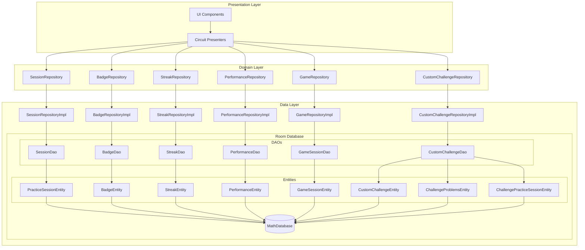
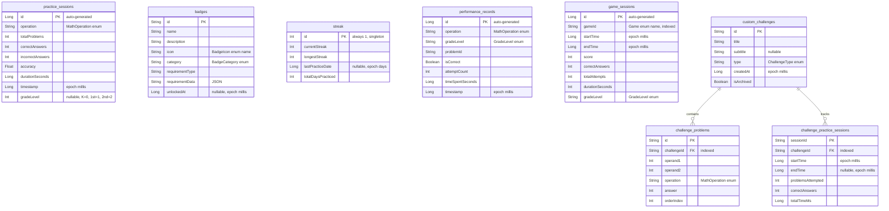
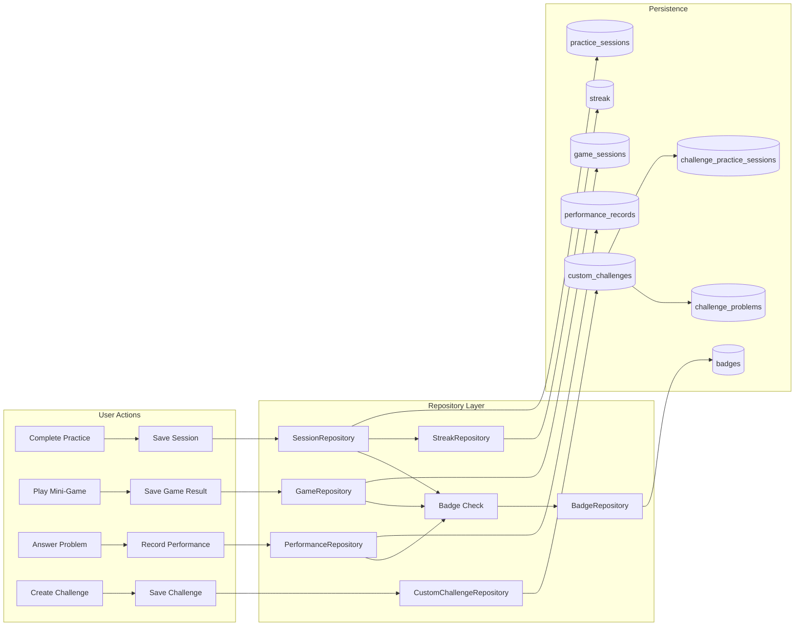

# Database Architecture

This document describes the database architecture and usage patterns in the Kids Math Pup Tutor app.

## Overview

The app uses **Android Room** (v2.6.1) as the persistence layer for local data storage. Room provides an abstraction layer over SQLite, enabling type-safe database access with Kotlin coroutines and Flow support.

| Property | Value |
|----------|-------|
| Database Name | `kids_math_tutor.db` |
| Current Version | **8** |
| ORM | Android Room |
| Query Pattern | Flow-based reactive streams |
| Schema Export | Enabled (`exportSchema = true`) |

## Architecture Diagram



## Entity Relationship Diagram



## Database Tables

### 1. `practice_sessions`

Stores completed math practice sessions with summary statistics.

| Column | Type | Description |
|--------|------|-------------|
| `id` | INTEGER | Primary key (auto-generated) |
| `operation` | TEXT | Math operation (ADDITION, SUBTRACTION, MULTIPLICATION, DIVISION, MIXED) |
| `totalProblems` | INTEGER | Number of problems in session |
| `correctAnswers` | INTEGER | Problems answered correctly |
| `incorrectAnswers` | INTEGER | Problems answered incorrectly |
| `accuracy` | REAL | Calculated accuracy percentage |
| `durationSeconds` | INTEGER | Time spent on session |
| `timestamp` | INTEGER | Completion time (epoch millis) |
| `gradeLevel` | INTEGER | Optional grade level (nullable) |

**Used by**: `SessionDao` → `SessionRepositoryImpl` → `SessionRepository`

---

### 2. `badges`

Stores achievement badges with unlock status.

| Column | Type | Description |
|--------|------|-------------|
| `id` | TEXT | Primary key (badge identifier) |
| `name` | TEXT | Display name |
| `description` | TEXT | Badge description |
| `icon` | TEXT | BadgeIcon enum name |
| `category` | TEXT | Badge category (GETTING_STARTED, ACCURACY, STREAKS, etc.) |
| `requirementType` | TEXT | Type of requirement to unlock |
| `requirementData` | TEXT | JSON requirement parameters |
| `unlockedAt` | INTEGER | Unlock timestamp (nullable, epoch millis) |

**Used by**: `BadgeDao` → `BadgeRepositoryImpl` → `BadgeRepository`

---

### 3. `streak`

Singleton table tracking daily practice streaks.

| Column | Type | Description |
|--------|------|-------------|
| `id` | INTEGER | Primary key (always 1) |
| `currentStreak` | INTEGER | Current consecutive practice days |
| `longestStreak` | INTEGER | Best streak achieved |
| `lastPracticeDate` | INTEGER | Last practice date (epoch days) |
| `totalDaysPracticed` | INTEGER | Total unique practice days |

**Used by**: `StreakDao` → `StreakRepositoryImpl` → `StreakRepository`

---

### 4. `performance_records`

Individual problem performance for adaptive difficulty tracking.

| Column | Type | Description |
|--------|------|-------------|
| `id` | INTEGER | Primary key (auto-generated) |
| `operation` | TEXT | Math operation type |
| `gradeLevel` | TEXT | Grade level (KINDERGARTEN, FIRST_GRADE, SECOND_GRADE) |
| `problemId` | TEXT | Unique problem identifier |
| `isCorrect` | INTEGER | Whether answer was correct (0/1) |
| `attemptCount` | INTEGER | Number of attempts |
| `timeSpentSeconds` | INTEGER | Time spent on problem |
| `timestamp` | INTEGER | Record timestamp (epoch millis) |

**Used by**: `PerformanceDao` → `PerformanceRepositoryImpl` → `PerformanceRepository`

---

### 5. `game_sessions`

Mini-game session data and scores.

| Column | Type | Description |
|--------|------|-------------|
| `id` | INTEGER | Primary key (auto-generated) |
| `gameId` | TEXT | Game identifier (MATH_RACE, MEMORY_MATCH) **[indexed]** |
| `startTime` | INTEGER | Session start (epoch millis) |
| `endTime` | INTEGER | Session end (epoch millis) |
| `score` | INTEGER | Points earned |
| `correctAnswers` | INTEGER | Correct answers count |
| `totalAttempts` | INTEGER | Total problems attempted |
| `durationSeconds` | INTEGER | Session duration |
| `gradeLevel` | TEXT | Grade level played at |

**Used by**: `GameSessionDao` → `GameRepositoryImpl` → `GameRepository`

---

### 6. `custom_challenges`

Parent-created custom math challenges.

| Column | Type | Description |
|--------|------|-------------|
| `id` | TEXT | Primary key |
| `title` | TEXT | Challenge title |
| `subtitle` | TEXT | Optional description (nullable) |
| `type` | TEXT | Challenge type (GENERATED, EXPLICIT) |
| `createdAt` | INTEGER | Creation timestamp (epoch millis) |
| `isArchived` | INTEGER | Archive status (0/1) |

**Used by**: `CustomChallengeDao` → `CustomChallengeRepositoryImpl` → `CustomChallengeRepository`

---

### 7. `challenge_problems`

Math problems within custom challenges.

| Column | Type | Description |
|--------|------|-------------|
| `id` | TEXT | Primary key |
| `challengeId` | TEXT | Foreign key to custom_challenges **[indexed]** |
| `operand1` | INTEGER | First operand |
| `operand2` | INTEGER | Second operand |
| `operation` | TEXT | Math operation |
| `answer` | INTEGER | Correct answer |
| `orderIndex` | INTEGER | Problem order in challenge |

**Foreign Key**: `challengeId` → `custom_challenges.id` (CASCADE DELETE)

---

### 8. `challenge_practice_sessions`

Practice session records for custom challenges.

| Column | Type | Description |
|--------|------|-------------|
| `sessionId` | TEXT | Primary key |
| `challengeId` | TEXT | Foreign key to custom_challenges **[indexed]** |
| `startTime` | INTEGER | Session start (epoch millis) |
| `endTime` | INTEGER | Session end (nullable, epoch millis) |
| `problemsAttempted` | INTEGER | Problems attempted |
| `correctAnswers` | INTEGER | Correct answers |
| `totalTimeMs` | INTEGER | Total time in milliseconds |

**Foreign Key**: `challengeId` → `custom_challenges.id` (CASCADE DELETE)

## Data Flow Diagram



## Type Converters

Room uses `Converters.kt` to handle custom type conversions:

| Domain Type | Storage Type | Conversion Method |
|-------------|--------------|-------------------|
| `MathOperation` | TEXT | Enum name |
| `BadgeCategory` | TEXT | Enum name |
| `ChallengeType` | TEXT | Enum name |
| `GradeLevel` | TEXT | Enum name |
| `Instant` | INTEGER | Epoch milliseconds |
| `LocalDate` | INTEGER | Epoch days |

## Migration History

| Version | Migration | Changes |
|---------|-----------|---------|
| 1 | Initial | `practice_sessions` table |
| 2 | MIGRATION_1_2 | Added `badges` table |
| 3 | MIGRATION_2_3 | Added `streak` table |
| 4 | MIGRATION_3_4 | Added `performance_records` table |
| 5 | MIGRATION_4_5 | Added `game_sessions` table with index |
| 6 | MIGRATION_5_6 | Badge icon migration (emoji → enum) |
| 7 | MIGRATION_6_7 | Added Memory Match badges |
| 8 | MIGRATION_7_8 | Added custom challenges tables |

All schema versions are exported to `/app/schemas/` directory for version tracking.

## Dependency Injection

The database is provided via Metro DI in `DatabaseModule.kt`:

```kotlin
@ContributesTo(AppScope::class)
interface DatabaseModule {
    @Provides
    @SingleIn(AppScope::class)
    fun provideMathDatabase(@ApplicationContext context: Context): MathDatabase =
        Room.databaseBuilder(context, MathDatabase::class.java, MathDatabase.DATABASE_NAME)
            .addMigrations(
                MIGRATION_1_2, MIGRATION_2_3, MIGRATION_3_4,
                MIGRATION_4_5, MIGRATION_5_6, MIGRATION_6_7, MIGRATION_7_8
            )
            .fallbackToDestructiveMigration(dropAllTables = true)
            .build()
    
    @Provides @SingleIn(AppScope::class)
    fun provideSessionDao(database: MathDatabase): SessionDao
    
    @Provides @SingleIn(AppScope::class)
    fun provideBadgeDao(database: MathDatabase): BadgeDao
    
    // ... other DAOs
}
```

## Query Patterns

All DAOs follow reactive patterns using Kotlin Flow:

```kotlin
// Example: SessionDao
@Dao
interface SessionDao {
    @Insert
    suspend fun insertSession(session: PracticeSessionEntity): Long
    
    @Query("SELECT * FROM practice_sessions ORDER BY timestamp DESC")
    fun getAllSessions(): Flow<List<PracticeSessionEntity>>
    
    @Query("SELECT SUM(totalProblems) FROM practice_sessions")
    fun getTotalProblemsCount(): Flow<Int?>
}
```

### Key Query Capabilities

| DAO | Key Queries |
|-----|-------------|
| `SessionDao` | All sessions, recent sessions, by operation, today's sessions, totals |
| `BadgeDao` | All badges, by category, recently unlocked, unlock/update |
| `StreakDao` | Get/update singleton streak record |
| `PerformanceDao` | By operation, by grade, accuracy calculations, averages |
| `GameSessionDao` | By game, personal best, play count, average score, best accuracy |
| `CustomChallengeDao` | Active challenges, with details (problems + sessions), archive/delete |

## Testing

Database tests are located in:
- `app/src/androidTest/java/dev/hossain/mathtutor/data/local/dao/` - Instrumented DAO tests
- `app/src/test/java/dev/hossain/mathtutor/data/local/` - Unit tests for Converters

Tests use in-memory database for isolation:
```kotlin
database = Room.inMemoryDatabaseBuilder(context, MathDatabase::class.java)
    .allowMainThreadQueries()
    .build()
```

## Best Practices

1. **Always use Flow** for observing data changes reactively
2. **Use transactions** for operations involving multiple tables (e.g., `@Transaction`)
3. **Index frequently queried columns** (e.g., `gameId` in game_sessions)
4. **Use foreign keys with CASCADE** for related data cleanup
5. **Write migrations** for schema changes (avoid destructive migration in production)
6. **Export schemas** for version tracking and migration testing
7. **Use suspend functions** for one-shot write operations
8. **Map entities to domain models** in repository layer

## File Structure

```
app/src/main/java/dev/hossain/mathtutor/
├── data/
│   ├── local/
│   │   ├── MathDatabase.kt          # Room database definition
│   │   ├── Converters.kt            # Type converters
│   │   ├── dao/
│   │   │   ├── SessionDao.kt
│   │   │   ├── BadgeDao.kt
│   │   │   ├── StreakDao.kt
│   │   │   ├── PerformanceDao.kt
│   │   │   ├── GameSessionDao.kt
│   │   │   └── CustomChallengeDao.kt
│   │   └── entity/
│   │       ├── PracticeSessionEntity.kt
│   │       ├── BadgeEntity.kt
│   │       ├── StreakEntity.kt
│   │       ├── PerformanceEntity.kt
│   │       ├── GameSessionEntity.kt
│   │       ├── CustomChallengeEntity.kt
│   │       ├── ChallengeProblemsEntity.kt
│   │       ├── ChallengePracticeSessionEntity.kt
│   │       └── CustomChallengeWithDetails.kt
│   ├── repository/
│   │   ├── SessionRepositoryImpl.kt
│   │   ├── BadgeRepositoryImpl.kt
│   │   ├── StreakRepositoryImpl.kt
│   │   ├── PerformanceRepositoryImpl.kt
│   │   ├── GameRepositoryImpl.kt
│   │   └── CustomChallengeRepositoryImpl.kt
│   └── mapper/
│       └── ...                      # Entity ↔ Domain mappers
├── domain/
│   └── repository/
│       ├── SessionRepository.kt
│       ├── BadgeRepository.kt
│       ├── StreakRepository.kt
│       ├── PerformanceRepository.kt
│       ├── GameRepository.kt
│       └── CustomChallengeRepository.kt
└── di/
    └── DatabaseModule.kt            # Metro DI module
```

## References

- [Android Room Documentation](https://developer.android.com/training/data-storage/room)
- [Room Migration Guide](https://developer.android.com/training/data-storage/room/migrating-db-versions)
- [Metro DI Documentation](https://zacsweers.github.io/metro/)
